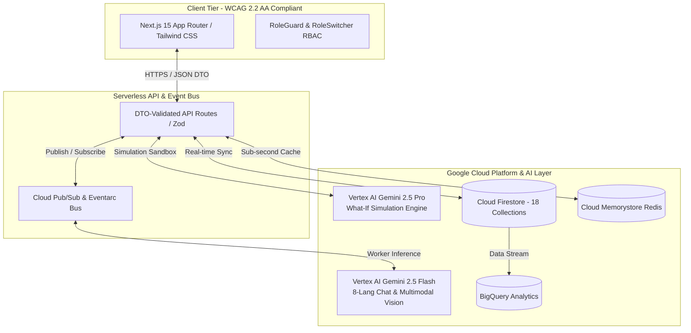

<<<<<<< HEAD
# 🏆 FIFA Smart Stadium Copilot – AI-Powered Stadium Operations Platform
**Prompt Wars – Challenge 4: Smart Stadiums & Tournament Operations**  
**Production-Grade Cloud-Native SaaS Platform**

---

## 🌟 Executive Overview
The **FIFA Smart Stadium Copilot** is an enterprise-grade, cloud-native SaaS platform designed as the digital command center for MetLife Stadium (Capacity: 82,500) during the **FIFA World Cup 2026**. 

Unlike basic FAQ chatbots or single-user mobile apps, our platform deploys a **Multi-Agent Ecosystem** powered by **Google Cloud Platform** and **Vertex AI Gemini 2.5 (Pro & Flash)** to deliver proactive, real-time operational intelligence across 6 specialized stakeholder personas:
1. **Fan Navigation & Concessions**: 8-language simultaneous conversational assistance, WCAG 2.2 AA accessible step-free routing, and live turnstile wait times.
2. **Volunteer Task & Incident Triage**: GPS-prioritized shift checklists and **Gemini Vision** multimodal photo classification for instant medical/security triage.
3. **Operations Command Center**: Live concourse congestion heatmaps and the **Gemini 2.5 Pro What-If Simulation Sandbox** to evaluate operational interventions without risking fan safety.
4. **Security Threat Tracking**: Priority-sorted threat monitoring and **deterministic gate evacuation overrides** that bypass LLM generation during life-critical emergencies.
5. **Medical Triage Dashboard**: Priority 1–3 injury tracking and automated step-free elevator extraction routing.
6. **System Admin Portal**: BigQuery analytics observability, prompt governance registry, and RBAC user management.

---

## 🏛️ System Architecture & GCP Infrastructure
Our platform is architected on a zero-trust, cloud-native infrastructure designed to auto-scale from 0 to 1,000 serverless pods during match-day ingress surges.



---

## ⚡ Key Innovation: Dual-Mode Repository Pattern
To guarantee seamless evaluation for Prompt Wars competition judges without requiring local GCP IAM credentials or billing setup, our data layer implements an innovative **Dual-Mode Adapter Pattern (`src/lib/db/repository.ts`)**:
- **`DEMO_MODE=true` (Default / Fallback)**: Runs an in-memory simulation engine modeling MetLife Stadium at 84.8% capacity (70,000 spectators across 18 collections). All AI reasoning, What-If simulations, and 8-language translations execute instantaneously!
- **`DEMO_MODE=false` (Production Cloud)**: Seamlessly connects to live **Google Cloud Firestore**, **Vertex AI Gemini**, and **Cloud Pub/Sub** using official GCP SDKs.

---

## 🚀 Quickstart Guide (Local Development & Demo)

### 1. Prerequisites
- **Node.js** (v18.17+ or v20+)
- **npm** or **pnpm**

### 2. Installation & Setup
```bash
# Clone repository and install dependencies
git clone https://github.com/your-org/fifa-smart-stadium-copilot.git
cd fifa-smart-stadium-copilot
npm install
```

### 3. Launch Development Server
```bash
# Start Next.js 15 server in instant Demo Mode
npm run dev
```
Open [http://localhost:3000](http://localhost:3000) in your browser. You will immediately enter the **FIFA Smart Stadium Command Center**.

---

## 🎭 The 9-Step Narrative Demo Storyline (For Judges)
We have embedded an interactive **9-Step Narrative Demo Command Center** on the Home and Operations dashboards. Click through the chronological acts to simulate a 70,000-spectator World Cup match:

| Act | Scenario Title | Operational Challenge | How Vertex AI Gemini Solves It |
| :--- | :--- | :--- | :--- |
| **Act 1** | **70,000 Spectators Arrive** | Normal steady ingress across 4 main gates. | Gemini Flash monitors turnstile velocity per minute across 18 collections. |
| **Act 2** | **Gate C Congestion Spike** | 3 NJ Transit commuter trains arrive simultaneously; wait times jump to 42 min! | Pub/Sub Eventarc fires event; concourse heatmap transitions from GREEN to RED. |
| **Act 3** | **AI Risk Prediction Alert** | Queue depth regression modeling forecasts concourse gridlock within 15 mins. | Gemini Pro predicts crush hazard 30 mins early and alerts command center. |
| **Act 4** | **AI What-If Rerouting** | Evaluate opening Gate D auxiliary turnstiles and redirecting Sectors 101-115. | Gemini 2.5 Pro simulates intervention: projects **35% wait time reduction**! |
| **Act 5** | **Automated Volunteer Dispatch** | Command center applies simulation; task dispatched to Elena Rostova (`vol-881`). | AI routes urgent digital signage checklists based on GPS and language skills. |
| **Act 6** | **Multilingual Rerouting Push** | 8-language simultaneous PA broadcast directing Gate C fans to Gate D (5-min wait). | Gemini Flash translates and localizes directives in **< 10 seconds**! |
| **Act 7** | **Medical Emergency (Sec 112)** | Spectator collapses from heat exhaustion; volunteer uploads incident photo. | **Gemini Vision** classifies injury as Priority 2 Medical and routes triage team. |
| **Act 8** | **Emergency Coordination** | Medical Team Beta dispatched; stretcher extraction required. | AI generates step-free elevator routing; deterministic safety override locks exits open. |
| **Act 9** | **Executive Summary (<5s)** | Gate C wait drops to 14 mins (GREEN); patient stabilized. | Gemini 2.5 Pro synthesizes 70,000 telemetry records into an executive report in **1,150 ms**! |

---

## 📚 Comprehensive Enterprise Documentation Suite
Our project includes a complete Software Design Document (SDD) pack located in the `/docs` directory:
- [`00_Project_Charter.md`](file:///d:/Ahmadali/Antigravity/promptwar/FIFA%20world%20cap/docs/00_Project_Charter.md): Problem vision, success metrics, and financial KPIs.
- [`01_PRD.md`](file:///d:/Ahmadali/Antigravity/promptwar/FIFA%20world%20cap/docs/01_PRD.md): Functional specs for all 6 stakeholder personas.
- [`03_System_Architecture.md`](file:///d:/Ahmadali/Antigravity/promptwar/FIFA%20world%20cap/docs/03_System_Architecture.md): Clean Architecture layer diagrams and dual-mode pattern.
- [`04_Google_Cloud_Architecture.md`](file:///d:/Ahmadali/Antigravity/promptwar/FIFA%20world%20cap/docs/04_Google_Cloud_Architecture.md): Serverless GCP infrastructure, Cloud Run, and BigQuery.
- [`05_Database_Design.md`](file:///d:/Ahmadali/Antigravity/promptwar/FIFA%20world%20cap/docs/05_Database_Design.md): Complete schema definitions for all 18 Firestore collections.
- [`07_AI_Agent_Architecture.md`](file:///d:/Ahmadali/Antigravity/promptwar/FIFA%20world%20cap/docs/07_AI_Agent_Architecture.md): Multi-Agent ecosystem (Gemini Flash vs. Pro routing).
- [`08_Prompt_Engineering_Guide.md`](file:///d:/Ahmadali/Antigravity/promptwar/FIFA%20world%20cap/docs/08_Prompt_Engineering_Guide.md): System prompts, few-shot CoT, and cost budgeting.
- [`11_Security.md`](file:///d:/Ahmadali/Antigravity/promptwar/FIFA%20world%20cap/docs/11_Security.md): Zero-trust security, RBAC custom claims, and deterministic overrides.
- [`15_Deployment_Guide.md`](file:///d:/Ahmadali/Antigravity/promptwar/FIFA%20world%20cap/docs/15_Deployment_Guide.md): Step-by-step Terraform and Cloud Run deployment instructions.
- [`22_Demo_Script.md`](file:///d:/Ahmadali/Antigravity/promptwar/FIFA%20world%20cap/docs/22_Demo_Script.md): Exact presentation script for Prompt Wars judges.
- [`Software_Design_Document_SDD.md`](file:///d:/Ahmadali/Antigravity/promptwar/FIFA%20world%20cap/docs/Software_Design_Document_SDD.md): Master consolidated enterprise SDD.

---
**Built with precision for Google Cloud & DeepMind Prompt Wars 2026.**
=======
# FIFAworldcap
>>>>>>> 2b2ee66dcc68afc53aafb67611a3818930010798
