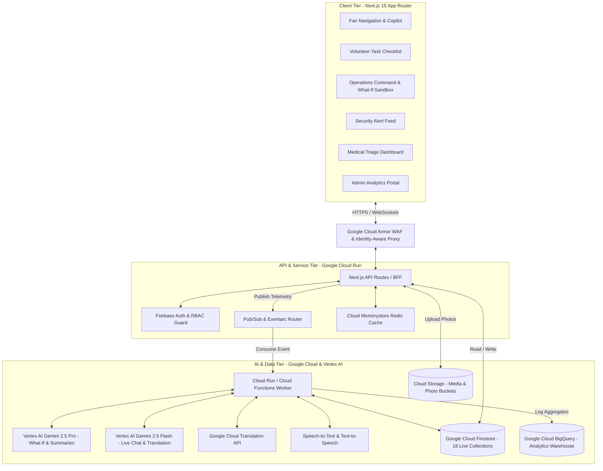

# 03 - System Architecture
**Project Title**: FIFA Smart Stadium Copilot – AI-Powered Stadium Operations Platform  
**Document Version**: 2.0 (Production-Grade Specification)  

---

## 1. High-Level Architecture Overview
The **FIFA Smart Stadium Copilot** is architected as an enterprise-grade, cloud-native SaaS platform following **Clean Architecture**, **SOLID engineering principles**, and an **event-driven serverless pattern**.

The platform is divided into three primary tiers:
1. **Client Tier (Presentation Layer)**: A Next.js 15+ responsive web application styled with Material Design 3 and Tailwind CSS. It delivers six role-tailored dashboards (**Fan, Volunteer, Operations, Security, Medical, Admin**) and an interactive SVG/vector stadium map with real-time crowd heatmaps.
2. **API & Event Tier (Service & Routing Layer)**: Hosted on Google Cloud Run, providing REST API endpoints validated by strict Zod Data Transfer Objects (DTOs). An asynchronous event bus powered by **Google Cloud Pub/Sub** and **Eventarc** decouples high-frequency telemetry from LLM inference.
3. **Data & AI Tier (Domain & Intelligence Layer)**: Powered by **Vertex AI Gemini 2.5 Pro & Flash** for deep multimodal reasoning, **Google Cloud Firestore** (18 live collections) for operational data, **Cloud Memorystore (Redis)** for sub-millisecond caching, and **BigQuery** for analytical aggregations.



---

## 2. Clean Architecture & Code Organization
The codebase strictly adheres to **Clean Architecture** to ensure UI components are completely independent of business logic and database adapters:

- **Presentation Layer (`src/app/`, `src/components/`)**: Contains React Server Components and Client Components formatted with shadcn/ui and Radix UI. Zero direct database queries or raw LLM API calls occur in this layer.
- **Service Layer (`src/services/`, `src/lib/ai/`)**: Encapsulates core business workflows (e.g., `CrowdControlService`, `EmergencyBroadcastService`, `WhatIfSimulationEngine`). Validates inputs via Zod DTOs and coordinates between repository adapters and Gemini reasoning clients.
- **Domain & Repository Layer (`src/domain/`, `src/lib/db/`)**: Defines strict TypeScript interfaces for all 18 Firestore collections and abstracts database access behind repository interfaces (`IStadiumRepository`, `IIncidentRepository`). This enables seamless switching between live Firestore and local demo memory.

---

## 3. Event-Driven Execution Flow (Deep Dive)
When an operational event occurs (e.g., turnstile velocity surge at Gate C or a volunteer snapping a photo of a medical emergency), the system processes the event asynchronously:

1. **Ingestion**: The client posts a payload to `/api/incidents`. The Next.js API route validates the payload against `IncidentCreateSchema` (Zod).
2. **Authentication & Rate Limiting**: Google Cloud Armor inspects the request for WAF violations, while Firebase Authentication verifies the user's JWT and custom role claims (`VOLUNTEER` or `SECURITY`).
3. **Event Publishing**: The API route writes the initial record to Firestore with status `PENDING_CLASSIFICATION` and immediately publishes an event `stadium.events.incident.created` to Google Cloud Pub/Sub.
4. **Asynchronous AI Inference**: Eventarc triggers the Cloud Run worker service. The worker fetches the photo from Cloud Storage and invokes **Vertex AI Gemini Vision**.
5. **Reasoning & State Update**: Gemini classifies the incident as `PRIORITY_2_MEDICAL`, recommends dispatching Triage Team Beta, and generates an accessible evacuation path. The worker updates the Firestore document to `ACTIVE_TRIAGE`.
6. **Live Dashboard Sync**: Firestore real-time listeners push the updated state to the Medical and Operations Command Center dashboards within **< 300 ms**, sounding an audible alert and updating the stadium map heatmap.

---

## 4. Dual-Mode Adapter Pattern (Demo Mode vs. Production Mode)
To satisfy both rapid local competition evaluation (without GCP credentials or network latency) and production cloud deployment, we implement an **Adapter Repository Pattern**:

```typescript
// Conceptual Architecture of our Dual-Mode Adapter
export interface IAIEngine {
  generateChatResponse(prompt: string, context: any): Promise<AIResponseDTO>;
  runWhatIfSimulation(scenario: WhatIfScenarioDTO): Promise<WhatIfResultDTO>;
  classifyIncidentPhoto(photoUrl: string): Promise<IncidentClassificationDTO>;
}

// In Production: Calls Vertex AI Gemini APIs directly
export class VertexAIEngine implements IAIEngine { /* ... */ }

// In Demo Mode: Returns intelligent, pre-calculated Gemini JSON reasoning structures
export class SimulatedAIEngine implements IAIEngine { /* ... */ }
```

When `DEMO_MODE=true` in environment configuration, the factory instantiate `SimulatedAIEngine` and `InMemoryRepository`, seeding the application with **MetLife Stadium (82,500 capacity)** and 70,000 simulated spectators.

---

## 5. Architecture Decision Records (ADRs)

### ADR-1: Why Google Cloud Firestore over Cloud SQL / PostgreSQL?
- **Context**: World Cup matches generate massive spikes in user traffic and telemetry during a 2-hour window.
- **Decision**: Selected **Google Cloud Firestore**.
- **Justification**: Firestore provides serverless auto-scaling, document-level security rules natively integrated with Firebase Auth, and real-time WebSocket listeners essential for live command center dashboards.

### ADR-2: Why Google Cloud Run over Kubernetes Engine (GKE)?
- **Context**: Hosting frontend SSR and backend microservices with variable load.
- **Decision**: Selected **Google Cloud Run**.
- **Justification**: Zero maintenance overhead, scale-to-zero capability during non-match days (reducing monthly costs to $\approx \$100-\$150$), and instant container scaling during peak ingress.

### ADR-3: Why Vertex AI Gemini over Third-Party LLMs?
- **Context**: Requiring multimodal reasoning (photo + voice analysis) and strict data privacy.
- **Decision**: Selected **Vertex AI Gemini 2.5 Pro & Flash**.
- **Justification**: Enterprise data privacy guarantees (no model training on tournament data), native multimodal vision/audio understanding, and massive context windows capable of analyzing thousands of live turnstile telemetry logs simultaneously.

### ADR-4: Why Pub/Sub and Eventarc over Direct Synchronous LLM Calls?
- **Context**: Preventing API timeouts when 1,000 volunteers report incidents simultaneously.
- **Decision**: Selected **Google Cloud Pub/Sub + Eventarc**.
- **Justification**: Decouples user-facing API ingestion from LLM inference latency. Ensures 100% request capture and retry resilience during network spikes.
