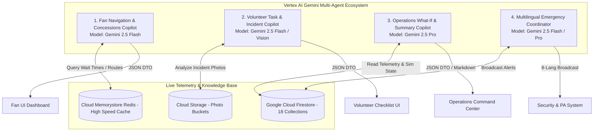

# 07 - AI Agent Architecture
**Project Title**: FIFA Smart Stadium Copilot – AI-Powered Stadium Operations Platform  
**Document Version**: 2.0 (Production-Grade Specification)  

---

## 1. Overview & Multi-Agent Ecosystem
The **FIFA Smart Stadium Copilot** replaces generic chatbot architectures with a **Multi-Agent Ecosystem** powered by **Vertex AI Gemini 2.5 Pro & Flash**. Rather than relying on a single monolithic LLM prompt, the platform deploys four distinct, domain-specialized AI Copilots tailored to the exact workflows of stadium stakeholders during the FIFA World Cup 2026.

Each Copilot is equipped with custom tools (function calling), domain knowledge retrieval from Firestore, and strict Zod runtime schema validation to guarantee zero-hallucination structured outputs.

---

## 2. Deep Dive: The 4 Domain-Specialized Copilots

### 1. Fan Navigation & Concessions Copilot (`FanCopilot`)
- **Primary Persona**: International tournament attendees seeking directions, food, and wait times.
- **Model**: `gemini-2.5-flash` (Optimized for sub-1,500ms TTFT streaming and multilingual conversational speed).
- **Core Capabilities**:
  - **Multilingual Understanding**: Seamlessly converses across 8 core World Cup languages (**English, Spanish, French, Portuguese, Arabic, Japanese, Hindi, German**) without manual language toggling.
  - **Context-Aware Navigation**: Reads user GPS/seat coordinates and calculates step-by-step polylines to gates, restrooms, and food stalls.
  - **Accessibility Nudging**: When an accessible profile is detected, automatically filters out stairs and recommends elevator/ramp polylines.
- **Structured Output DTO (`FanCopilotResponseDTO`)**: Returns conversational text alongside actionable UI cards (e.g., `"Navigate to Gate D"`, `"View Taco Fiesta Menu"`).

### 2. Volunteer Task & Incident Copilot (`VolunteerCopilot`)
- **Primary Persona**: Stadium volunteers and ground staff managing crowd flow and reporting safety anomalies.
- **Model**: `gemini-2.5-flash` for task checklists; **Gemini 2.5 Vision** for multimodal photo analysis.
- **Core Capabilities**:
  - **Multimodal Photo Classification**: When a volunteer snaps a photo of a broken turnstile or medical emergency, Gemini Vision analyzes the image, identifies severity (1–10), classifies incident type (`MEDICAL`, `SECURITY`, `CROWD_CONGESTION`), and assigns the required triage team.
  - **Voice Note Summarization**: Transcribes and summarizes volunteer audio reports into clean, structured Firestore incident tickets.
  - **Shift Troubleshooting**: Provides step-by-step guidance for ticket scanner reboots, lost child protocols, and gate crowd control.

### 3. Operations What-If & Summary Copilot (`OperationsCopilot`)
- **Primary Persona**: Command center supervisors overseeing 70,000+ spectators and gate bottleneck mitigation.
- **Model**: `gemini-2.5-pro` (Optimized for deep reasoning, multi-variable constraint evaluation, and synthesis).
- **Core Capabilities**:
  - **What-If Simulation Sandbox**: Evaluates hypothetical interventions (e.g., *"What if we close Gate C and redirect commuter trains to Gate D?"*). Gemini analyzes 18 Firestore collections and calculates projected wait time reductions, affected sectors, and step-by-step re-routing instructions.
  - **Queue Regression Modeling**: Predicts concourse gridlock 30 minutes before it occurs by analyzing turnstile velocity trends.
  - **Executive Incident Summarization**: Aggregates multi-faceted operational incidents into professional markdown executive reports in **< 5 seconds**.

### 4. Multilingual Emergency Coordinator (`EmergencyCopilot`)
- **Primary Persona**: Security leads, medical directors, and public address (PA) announcers.
- **Model**: `gemini-2.5-flash` for high-speed translation; hardcoded deterministic safety overrides.
- **Core Capabilities**:
  - **8-Language Emergency Broadcast Generation**: Automatically generates localized, culturally appropriate evacuation and safety announcements across all 8 supported languages in **< 10 seconds**.
  - **Deterministic Evacuation Overrides**: Crucially, life-critical gate unlock commands and fire evacuation alarms **bypass LLM generation entirely**, executing hardcoded deterministic safety scripts to guarantee zero latency and zero hallucination risk.

---

## 3. Model Selection Justification (`gemini-2.5-pro` vs. `gemini-2.5-flash`)
To balance reasoning depth, latency, and financial costs, we implement strict model routing:
- **`gemini-2.5-flash`**: Used for 80% of platform traffic (Fan FAQ, translation, volunteer checklists, and real-time chat). It delivers sub-second responses at 1/10th the cost of Pro models.
- **`gemini-2.5-pro`**: Reserved exclusively for the Operations Command Center's **What-If Simulation Engine** and executive multi-incident summarization. These tasks require evaluating complex, multi-variable constraints across thousands of data points where deep reasoning is paramount.
